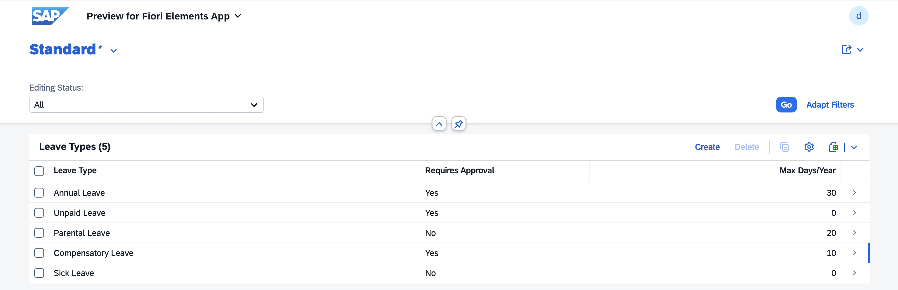
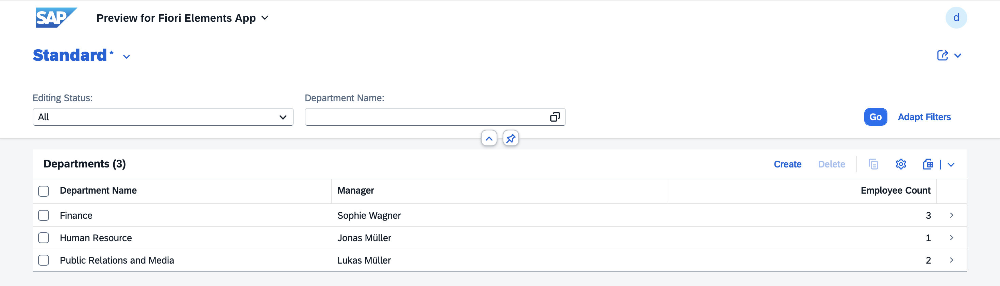
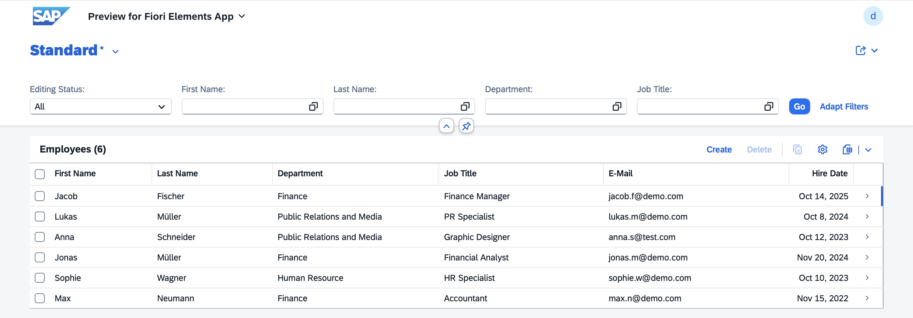
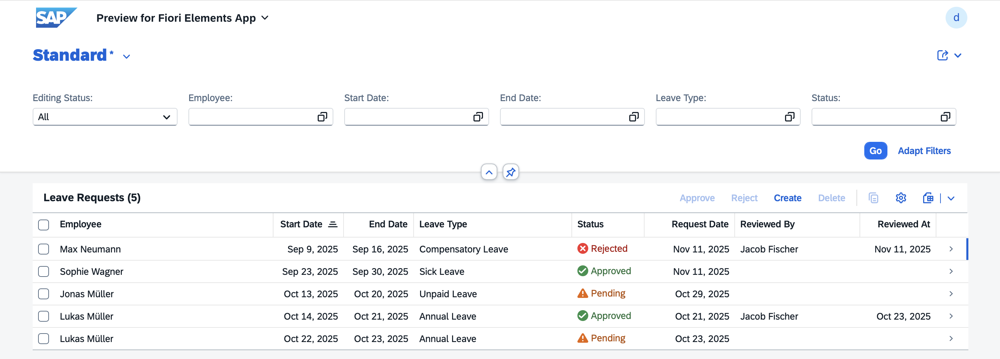
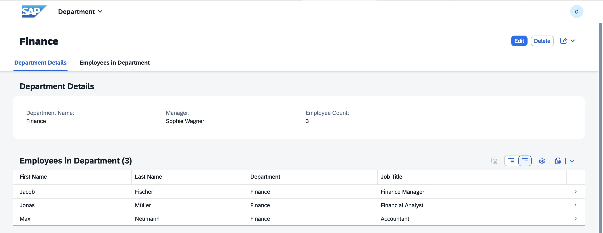
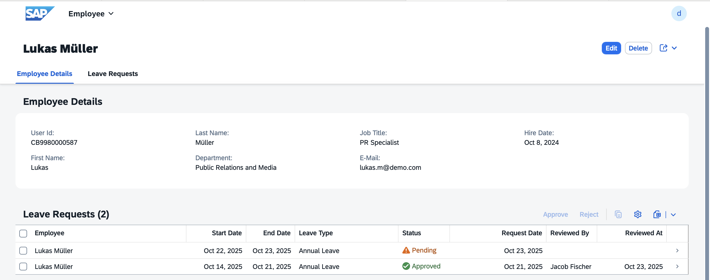
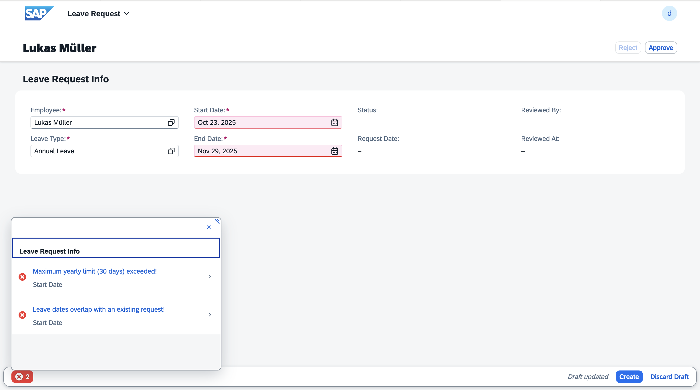

# 🧾 Leave Management App - ABAP Cloud (RAP)

This **Leave Management Application** is built with **ABAP Cloud** and the **RESTful ABAP Programming Model (RAP)**.  
It allows employees to submit leave requests and enables managers to approve or reject them through the Fiori Elements interface.

The application was developed as a **learning and demo project** on **SAP BTP Trial (ABAP Environment)**.  
It demonstrates how to build a full RAP-based CRUD application, including **determinations**, **validations**, and **UI annotations**.

## 📘 Technologies: 

In this project, I mainly used the following technologies and concepts:
<!--
- **ABAP Dictionary Objects** – defined tables, data elements, and domains for reusable and consistent data structures  
- **Core Data Services (CDS)** – for defining entities, associations, and projections  
- **RAP (RESTful ABAP Programming Model)** – structured the app using business objects, behaviors, and service exposure
- **Behavior Definitions & Implementations** – to handle validations, determinations, and actions (Approve / Reject)  
- **Value Helps** – implemented CDS-based value helps for selections  
- **Message Classes** – used for custom validation messages and user-friendly error handling
- **UI Annotations** – to control how data is displayed (icons, visibility, grouping, etc.)
- **Fiori Elements** – added UI annotations to improve how data is displayed in List Report and Object Page  
- **Eclipse ADT (ABAP Development Tools)** – main development environment for coding, activation, and testing  
- **ABAP Cloud Environment (SAP BTP Trial)** – for developing and deploying the application  
-->
| Technology / Concept | Description |
|---------------------|-------------|
| **ABAP Dictionary Objects** | Defined tables, data elements, and domains for reusable and consistent data structures |
| **Core Data Services (CDS)** | For defining entities, associations, and projections |
| **RAP (RESTful ABAP Programming Model)** | Structured the app using business objects, behaviors, and service exposure |
| **Behavior Definitions & Implementations** | To handle validations, determinations, and actions (Approve / Reject) |
| **Value Helps** | Implemented CDS-based value helps for selections |
| **Message Classes** | Used for custom validation messages and user-friendly error handling |
| **UI Annotations** | To control how data is displayed (icons, visibility, grouping, etc.) |
| **Fiori Elements** | Added UI annotations to improve how data is displayed in List Report and Object Page |
| **Eclipse ADT (ABAP Development Tools)** | Main development environment for coding |
| **ABAP Cloud Environment (SAP BTP Trial)** | For developing and deploying the application |

## 🧩 Data Model and Business Rules

The application is built around four main entities that form the core of the leave management process.

| Entity | Description | Important Fields |
|--------|--------------|------------------|
| **Employee** | Stores basic employee and department information | EmployeeID, FirstName, LastName, Email, DepartmentID |
| **Department** | Contains department data and assigned manager | DepartmentID, DepartmentName, ManagerID |
| **LeaveType** | Defines available leave types and their yearly limits | LeaveTypeID, LeaveName, RequiresApproval, MaxDaysPerYear |
| **LeaveRequest** | Represents a leave request created by an employee | RequestID, EmployeeID, LeaveTypeID, StartDate, EndDate, Status |

### ⚙️ Business Rules and Validations

#### 🔹 **Validations**
- **Mandatory Fields:** Each entity checks that its required fields (e.g., names, IDs, or dates) are filled before saving.  
- **Date Range Check (LeaveRequest):** `StartDate` must be earlier than `EndDate`.  
- **Overlapping Check (LeaveRequest):** An employee cannot have overlapping leave requests for the same period.  
- **Maximum Days Validation (LeaveRequest):** Total requested days must not exceed `LeaveType.MaxDaysPerYear`.  
- **Approval Requirement (LeaveRequest):** Certain leave types (e.g., Annual, Unpaid) require manager approval.  
- **Manager Assignment Check (Department):** Checks if the selected employee is already the manager of another department.

#### 🔹 **Determinations**
- **Request Date Auto-set:** When a new leave request is created, the `RequestDate` field is automatically set to the current date.  
- **Default Status:** When a leave request is created, the `Status` is determined based on the leave type:  
  - If the selected leave type **requires approval**, the status is set to **Pending**.  
  - Otherwise, the status is automatically set to **Approved**.
- **Managed Fields Auto-fill:** Standard managed fields such as `CreatedBy`, `CreatedAt`, and `LastChangedAt` are automatically filled by the RAP framework.  

#### 🔹 **Actions**
- **Approve:** Available only for leave requests with `Status = 'Pending'`. It updates the request status to **Approved** and records `ApprovedBy = $session.user`.  
- **Reject:** Available only for leave requests with `Status = 'Pending'`.  It updates the request status to **Rejected**.

> **Note:**  
> In a real production system, **RAP DCL roles** would be used to restrict data access (e.g., employees see only their own requests, managers see their team’s).  
> Since this demo runs on **SAP BTP Trial**, which supports only **one user**, no authorization logic was implemented — all requests are visible to that user.

## 📸 Screenshots

*Leave Types in List Report View*

*Departments in List Report View*

*Employees in List Report View*

*Leave Requests in List Report View*

*Object Page showing department details*

*Object Page showing employee details*

  
*Example of validation messages shown during leave request creation*
